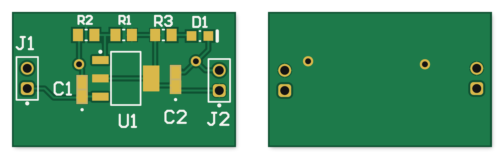
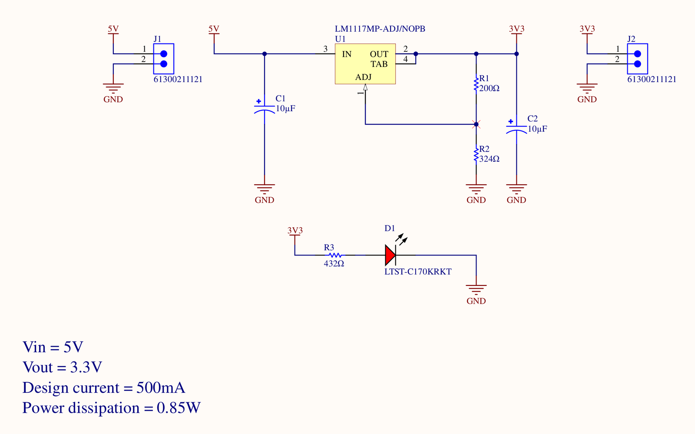
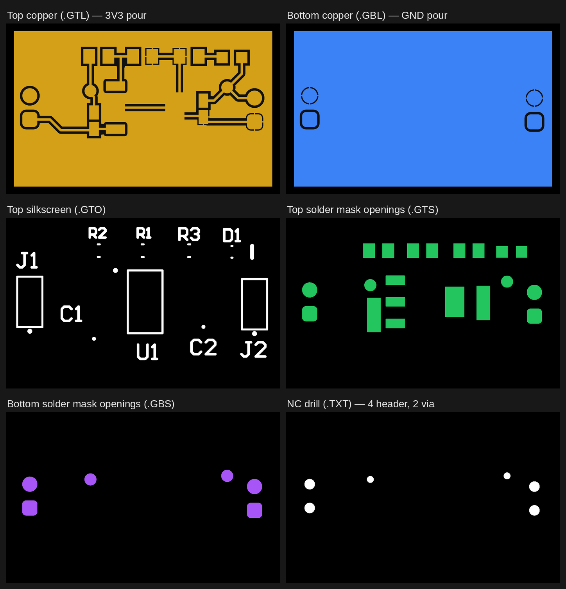

# LM1117 3.3 V Regulator Board

A 5 V → 3.3 V linear regulator board for loads up to 500 mA, on a 28 × 17 mm two-layer PCB. I did the schematic, part selection, layout and fabrication outputs in Altium Designer 26. It was my first PCB.


<sub>Top (left) and bottom (right), rendered from the Gerber and drill files in [`fabrication/`](fabrication/).</sub>

> **Status:** design complete, DRC clean, fabrication files generated. Not yet fabricated or tested. All performance figures below are calculated, not measured.

---

## Specs

| | |
|---|---|
| Input | 5 V via J1 (2-pin 2.54 mm header) |
| Output | 3.29 V nominal, 3.19–3.41 V worst case, via J2 |
| Design load | 500 mA |
| Regulator | TI LM1117-ADJ, SOT-223 |
| Dissipation at full load | 0.85 W |
| Junction temperature | 89 °C at 25 °C ambient, 109 °C at 45 °C (limit 125 °C) |
| Board | 28 × 17 mm, 2 layers, 1 oz copper |
| Power indicator | Red LED on the 3.3 V rail, 3 mA |
| Parts | 9 components, $5.64 CAD ([BOM](bom/BOM.csv)) |

## Schematic



- **J1** brings in 5 V and **J2** takes 3.3 V out. Pin 1 is the rail and pin 2 is ground on both. Pin 1 is the square pad.
- **R1/R2** set the output voltage through the ADJ pin.
- **C1** on the input and **C2** on the output, both tantalum.
- **D1 + R3** sit on the 3.3 V rail, so the LED shows the regulator is actually producing an output, not just that 5 V is plugged in.

Full sheet: [`docs/schematic.pdf`](docs/schematic.pdf)

---

## Key design decisions

Full working for every number is in [`docs/design-notes.md`](docs/design-notes.md).

**Output voltage: R1 = 200 Ω, R2 = 324 Ω**

    Vout = Vref × (1 + R2/R1) + Iadj × R2
         = 1.25 × (1 + 324/200) + 60 µA × 324
         = 3.275 + 0.019 = 3.294 V

- My first attempt was 1 kΩ / 1.65 kΩ. There the ADJ pin current alone added 99–198 mV (+3 % to +6 %). Dropping both by 5× cut that to 19–39 mV.
- The divider now draws 6.25 mA. That's also above the LM1117's 5 mA worst-case minimum load, so the output stays in regulation with nothing plugged into J2.
- Worst case with 1 % resistors, Vref limits and ADJ current over 0–125 °C is 3.19–3.41 V, inside a ±5 % rail (3.135–3.465 V).

**Thermal: 346 mm² copper pour on the tab**

    P  = (Vin − Vout) × I = (5 − 3.3) × 0.5 = 0.85 W
    Tj = Ta + P × θJA

- The SOT-223 tab is V_OUT, not ground (datasheet Fig. 6-1). So the heatsink pour is on the 3V3 net, not GND.
- With the bare pad (θJA = 136 °C/W) the junction would hit 141 °C at 25 °C ambient, so the pour is required.
- The built pour is 346 mm² (0.54 in²). That puts θJA at about 75 °C/W (TI Table 9-2), giving Tj = 89 °C at 25 °C and 109 °C at 45 °C.

**Output capacitor: tantalum, chosen for ESR**

- The LM1117 needs 0.3–22 Ω of ESR on the output capacitor to keep its loop stable.
- A ceramic (≈5 mΩ) or a tantalum-polymer part is below that window and could oscillate.
- Used a Kyocera AVX F921A106MPA: 10 µF, 10 V, ESR 6 Ω. The 10 V rating is 2× derating on the 5 V input, since tantalums fail short when over-voltaged.

**Trace width: 0.254 mm everywhere**

    IPC-2221 (external): I = 0.048 × ΔT^0.44 × A^0.725

- At 1 oz (1.4 mil), a 0.254 mm trace carries 0.90 A for a 10 °C rise, or rises 2.7 °C at 0.5 A.
- The minimum width for 0.5 A would be 0.11 mm.

## Layout



- **Top:** 3V3 pour (346 mm²) bonded to the regulator tab with a **direct connect** rule on U1. Thermal-relief spokes would choke the heat path the pour exists for. Everything else uses 4-spoke relief so it stays hand-solderable.
- **Bottom:** solid GND pour. J1/J2 ground pins are through-hole and land on it directly. The SMD ground pads on top reach it through **two 0.71 mm vias**.
- **Placement** runs input on the left to output on the right: J1 → C1 → U1 → C2 → J2. The divider and LED sit in a row along the top edge.
- **C1/C2 solder mask:** the tantalum footprint leaves only 0.24 mm between pads, under the 0.254 mm minimum mask sliver. I set +0.2 mm mask expansion on those two parts, which merges each pair of openings into one. No sliver means no violation, at the cost of no mask dam between the pads, so they need care to avoid a solder bridge.

**DRC: 0 violations, 0 warnings** ([report](docs/DRC_report.html)). The exported Gerber and drill files were also cross-checked independently: holes centred on pads, netlist, pour area, polarity. See [`docs/verification.md`](docs/verification.md).

## Bill of materials

| Ref | Part | MPN | Package | Qty | Unit (CAD) |
|---|---|---|---|---|---|
| U1 | LDO regulator, adjustable | TI LM1117MP-ADJ/NOPB | SOT-223 | 1 | 2.58 |
| C1, C2 | 10 µF 10 V tantalum, ESR 6 Ω | Kyocera AVX F921A106MPA | 0805 | 2 | 1.00 |
| R1 | 200 Ω 1 % | KOA RK73H2ATTD2000F | 0805 | 1 | 0.14 |
| R2 | 324 Ω 1 % | KOA RK73H2ATTD3240F | 0805 | 1 | 0.14 |
| R3 | 432 Ω 1 % | KOA RK73H2ATTD4320F | 0805 | 1 | 0.14 |
| D1 | Red LED | Lite-On LTST-C170KRKT | 0805 | 1 | 0.26 |
| J1, J2 | 2-pin header, 2.54 mm | Würth 61300211121 | THT | 2 | 0.19 |
| | | | | **9** | **$5.64** |

With DigiKey part numbers: [`bom/BOM.xlsx`](bom/BOM.xlsx) · [`bom/BOM.csv`](bom/BOM.csv)

## Known issues and Rev 2

- **Mechanical 1 carries a "U1" label** from the regulator footprint as well as the board outline. Use `PCB2.GM` (board profile) as the outline layer when ordering. See [`fabrication/README.md`](fabrication/README.md).
- **No pin labels on the silkscreen.** Only the square pad marks pin 1. Rev 2 should print `5V` / `GND` / `3V3` next to J1 and J2.
- **No reverse-polarity protection.** Swapping the J1 wires would reverse-bias C1. A series Schottky or P-FET would fix that at the cost of some headroom.
- **Thermal numbers come from TI's still-air test board**, not a measurement. Rev 2 would build the board and check the tab temperature at 500 mA.

## Repository layout

```
hardware/      Altium project: LM1117_Regulator.PrjPcb (open this), Sheet1.SchDoc, PCB2.PcbDoc,
               LM1117_Regulator.BomDoc (ActiveBOM), F921A106MPA/ (capacitor symbol + footprint)
fabrication/   Gerbers (RS274X, mm 4:4), NC drill, zipped fab package, fab notes
bom/           Bill of materials (.xlsx with formulas, .csv)
docs/          Schematic PDF, design notes, verification, DRC report, images
```

## Background

The requirements (5 V → 3.3 V at 500 mA, LM1117-ADJ, two layers) came from the WATonomous Humanoid electrical onboarding assignment. This repository is my own cleaned-up version of that design.
